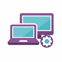

=======================
IT Equipment Management
=======================

This module is a comprehensive solution for tracking IT assets (laptops, monitors, software)
and managing their assignment to employees. Developed as part of the "Base Developer Course".

Key Features
============
* **Asset Lifecycle**: Track equipment from purchase to scrap status.
* **Smart Assignments**: Link equipment to HR Employees with full history.
* **Software Management**: Track software installations and license keys on specific devices.
* **Automated Offboarding**: Wizard for mass equipment return when an employee leaves.
* **Reporting**: PDF reports for equipment handover and inventory status.

Configuration
=============
1. Install the module.
2. Go to **Settings > Users & Companies > Users**.
3. In the "Privileges" section, locate **IT Infrastructure Management** and assign:
   * **User**: View personal and available equipment.
   * **Administrator**: Full access to all IT infrastructure records.

Technical Details
=================
* **Version**: 19.0.1.0.2
* **Dependencies**: ``base``, ``mail``, ``hr``.
* **Tests**: Includes automated test cases for assignments and wizard logic.
